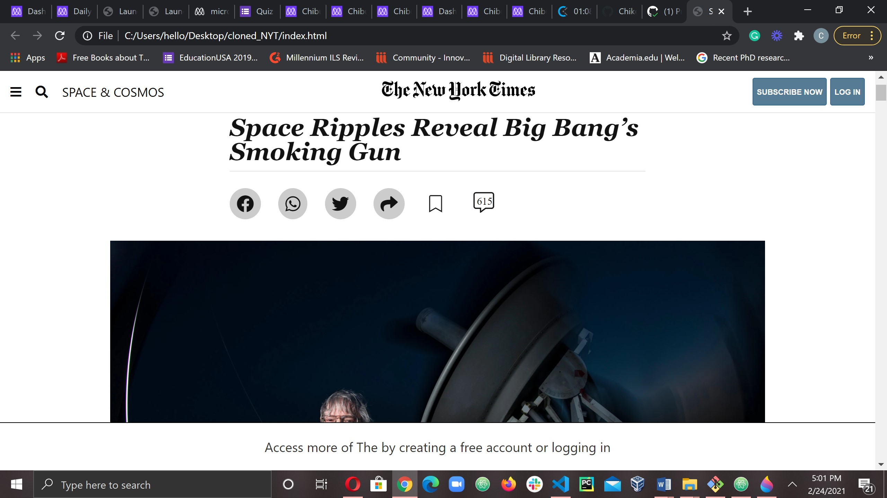

# nyt_project

> A clone of New York Times article

It's a New York Times webpage built with HTML 5 semantic tags, CSS grid, flex, etc.

## Built With

- HTML5 AND CSS3
- Editors (VS Code), Git, Github,

## Live Demo

[Live Demo Link](https://chike1990.github.io/nyt_project/)

## Authors

👤 **Chibuike Uzoechina**

- GitHub: [@githubhandle](https://github.com/Chike1990)
- Twitter: [@twitterhandle](https://twitter.com/@ChibuikeUzoechi)
- LinkedIn: [LinkedIn](https://www.linkedin.com/in/chibuike-uzoechina-630857102)

## 🤝 Contributing

Contributions, issues, and feature requests are welcome!

Feel free to check the [issues page](issues/).

## Show your support

Give a ⭐️ if you like this project!

## 📝 License

This project is [MIT](lic.url) licensed.
